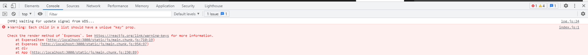
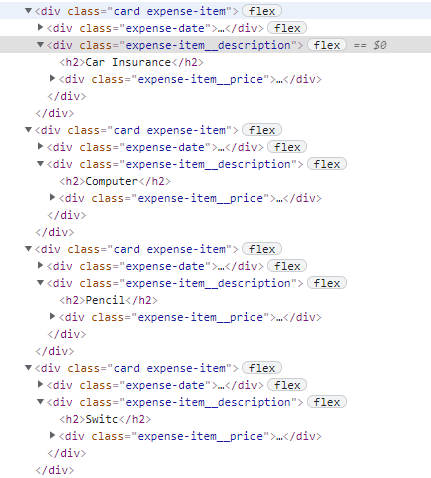
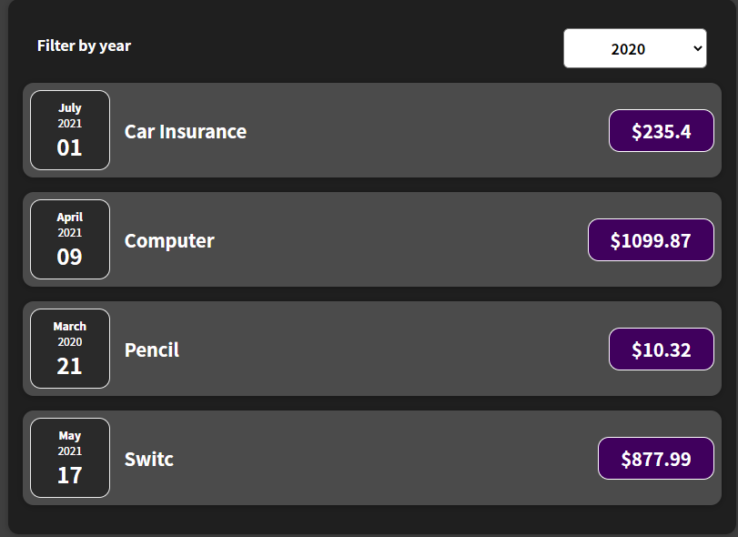
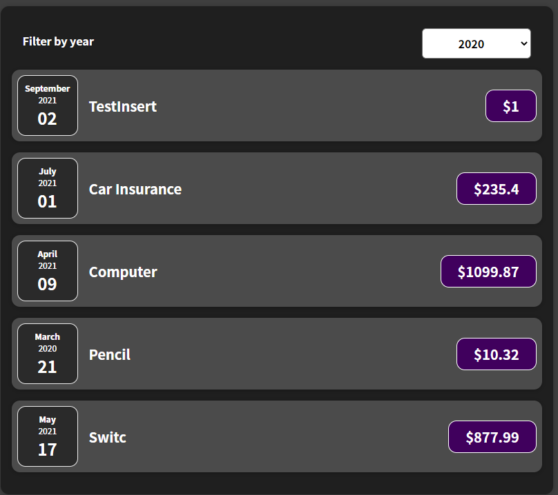

# The process of learning React
這是一個React相關的學習紀錄

## RenderLists&ConditionalContent
This Section is about Rendering Lists and Conditional Content.


1. 使用 Array.prototype.map() 來達到動態產生 Expenses 中的 ExpenseItem。
```
    {props.expenseData.map((expense) => (
        <ExpenseItem date={expense.date} title={expense.title} price={expense.price} />
    ))}
```
> 利用map的方式動態產生Exepenses後，利用開發者模式會發現以下錯誤訊息。
> 
> 此訊息是在說明 React 建議利用 array 動態產生畫面時，每個 array 的元素都應有對應的 key 值，若沒有的話可能會有 Bug 或效能問題，此項問題會在第3點的時候說明。

2. 於 App.js 中，賦予 Expense 資料 State，經由 React 的 State 可以做到新增 Expense 項目的時候，重新渲染 Expenses 區塊。
```
  const [expenses, setExpenses] = useState(DUMMY_EXPENSES);

  const addExpenseHandler = (expense) => {
    setExpenses(prevExpenses=> {
      return [expense, ...prevExpenses];
    });
  }
```

3. React Key 值運用
在前面的步驟中，我們將 Expenses 改為使用動態的方式去產生，但是在開發者模式卻產生以下錯誤訊息：
> 
這代表甚麼意思？舉例來說，假設今天 App.js 的資料如下要呈現到畫面上↓
```
const DUMMY_EXPENSES = [
  {
    id: 'e1',
    date: new Date(2021, 6, 1),
    title: 'Car Insurance',
    price: 235.4
  },
  {
    id: 'e2',
    date: new Date(2021, 3, 9),
    title: 'Computer',
    price: 1099.87
  },
  {
    id: 'e3',
    date: new Date(2020, 2, 21),
    title: 'Pencil',
    price: 10.32
  },
  {
    id: 'e4',
    date: new Date(2021, 4, 17),
    title: 'Switc',
    price: 877.99
  },
];
```
呈現到畫面上後會組成如下：
> html
> 

> 畫面
> 

假設今天新增一筆新的 Expense ，雖然畫面呈現會顯示在第一筆...

> 新增後畫面
> 

實際上 React 會先將新增的資料放置最後一筆後，再重新更新一次所有 Items ，按照 Array 的順序抽換裡面的資料，讓顯示出來的畫面與 Array 裡面的資料一致。雖然結果與預期相符，但是並不是那麼的有效率，並且可能會導致 Bug 產生。

* 為了解決這個問題，我們可以使用 Key 這個方式讓 React 去辨別那個項目被改變：
```
{props.expenseData.map((expense) => (
    <ExpenseItem
        key={expense.id} // Using key to let React identified which item is changed or add
        date={expense.date}
        title={expense.title}
        price={expense.price}
    />
))}
```

